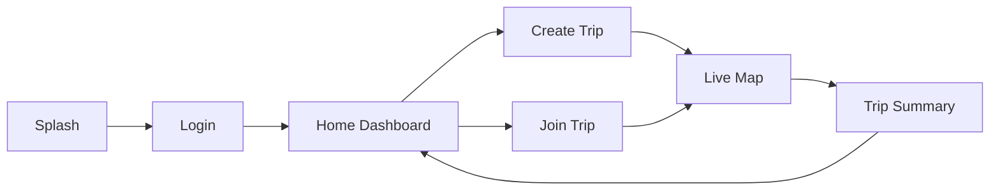

# 🏍️ TripBuddy — Group Ride Tracking App

**Track your group. Stay together. Never lose your ride again.**

TripBuddy is a real-time group ride tracking web application built for motorcycle riders and cycling groups. Create a trip, share a code with your buddies, and track everyone's position live on the map.


---

## ✨ Features

| Feature | Description |
|---|---|
| 🔐 **Google & Email Auth** | Free-tier Firebase authentication — no billing required |
| 🗺️ **Live Map Tracking** | Real-time location tracking of all group members on an interactive Leaflet map |
| 📍 **Trip Sessions** | Create/join trips with unique 6-character codes (e.g., `TB4X9K`) |
| 🚨 **SOS Alerts** | Emergency alert system to notify all riders in the group instantly |
| 🛑 **Stop Detection** | Automatically detects when a rider has stopped moving |
| 📊 **Trip Summary** | Post-ride stats: distance, duration, stops, per-rider breakdown |
| 📱 **Mobile-First UI** | Designed for phone screens — use while riding (passenger mode) |

---

## 🛠️ Tech Stack

| Layer | Technology |
|---|---|
| **Frontend** | React 19 (JSX) + Vite 8 |
| **Styling** | Vanilla CSS with custom design system (Inter font, CSS variables) |
| **Maps** | Leaflet + OpenStreetMap (free, no API key needed) |
| **Auth** | Firebase Authentication (Google Sign-In + Email/Password) |
| **Database** | Cloud Firestore (real-time sync) |
| **Hosting** | Firebase Hosting / Vercel / Netlify |

---

## 📁 Project Structure

```
tripbuddy/
├── index.html                    # Root HTML entry point
├── vite.config.js                # Vite + React plugin configuration
├── package.json                  # Dependencies and scripts
├── .env                          # Firebase credentials (not committed)
├── .gitignore
│
├── src/
│   ├── main.jsx                  # React DOM entry point
│   ├── App.jsx                   # Route definitions + protected routes
│   │
│   ├── context/
│   │   └── AuthContext.jsx       # Global auth state provider
│   │
│   ├── firebase/
│   │   ├── config.js             # Firebase app initialization
│   │   ├── authService.js        # Google + Email auth functions
│   │   ├── tripService.js        # Trip CRUD (create, join, start, end)
│   │   └── locationService.js    # Geolocation tracking + Firestore sync
│   │
│   ├── hooks/
│   │   └── useTripBuddy.js       # Main trip logic hook (location, events, state)
│   │
│   ├── pages/
│   │   ├── SplashPage.jsx        # Landing / splash screen
│   │   ├── LoginPage.jsx         # Google + Email login/signup
│   │   ├── HomePage.jsx          # Dashboard: trips, stats, create/join
│   │   ├── LiveMapPage.jsx       # Real-time map with rider markers
│   │   └── SummaryPage.jsx       # Post-ride summary and stats
│   │
│   ├── components/
│   │   ├── BottomNav.jsx         # Tab navigation bar
│   │   ├── CreateTripModal.jsx   # Modal to create new trip
│   │   ├── JoinTripModal.jsx     # Modal to join via code
│   │   ├── SOSModal.jsx          # Emergency SOS alert modal
│   │   └── AlertToast.jsx        # Toast notification component
│   │
│   └── styles/
│       └── index.css             # Complete design system (400+ lines)
│
└── dist/                         # Production build output
```

---

## 🚀 Getting Started

### Prerequisites

- [Node.js](https://nodejs.org/) v18+ installed
- A [Firebase](https://console.firebase.google.com/) project with:
  - **Authentication** → Enable **Google** and **Email/Password** providers
  - **Cloud Firestore** → Create a database (start in test mode)

### 1. Clone the Repo

```bash
git clone https://github.com/dineshrookie/tripbuddy.git
cd tripbuddy
```

### 2. Install Dependencies

```bash
npm install
```

### 3. Configure Firebase

Create a `.env` file in the project root:

```env
VITE_FIREBASE_API_KEY=your_api_key
VITE_FIREBASE_AUTH_DOMAIN=your-project.firebaseapp.com
VITE_FIREBASE_PROJECT_ID=your-project-id
VITE_FIREBASE_STORAGE_BUCKET=your-project.appspot.com
VITE_FIREBASE_MESSAGING_SENDER_ID=your_sender_id
VITE_FIREBASE_APP_ID=your_app_id
```

> Get these values from Firebase Console → ⚙️ Project Settings → General → Your apps → Web app config.

### 4. Run the Dev Server

```bash
npm run dev
```

The app will be available at **http://localhost:5173/**.

### 5. Build for Production

```bash
npm run build
```

Output goes to the `dist/` folder, ready for deployment.

---

## 🔒 Authentication

TripBuddy uses **free-tier Firebase Authentication** methods:

| Method | Billing | How it works |
|---|---|---|
| **Google Sign-In** | ✅ Free | One-click popup login via Google account |
| **Email / Password** | ✅ Free | Traditional signup + login with email |

> Phone/OTP authentication was removed because it requires Firebase Blaze (paid) plan.

---

## 🗺️ How It Works

```
1. Sign in  →  Google or Email
2. Create Trip  →  Get a unique code (e.g., TB4X9K)
3. Share Code  →  Send to your riding buddies
4. Buddies Join  →  Enter code on their phones
5. Start Trip  →  Host hits "Start" — live tracking begins
6. Ride!  →  See everyone on the map in real-time
7. End Trip  →  View summary with stats for all riders
```

### User Flow



---

## 📱 Screenshots

| Splash | Login | Home | Live Map |
|---|---|---|---|
| Dark gradient landing | Google + Email auth | Dashboard + stats | Real-time rider tracking |

---

## 🧪 Scripts

| Command | Description |
|---|---|
| `npm run dev` | Start Vite dev server (port 5173) |
| `npm run build` | Production build to `dist/` |
| `npm run preview` | Preview production build locally |

---

## 🔮 Future Enhancements (Phase 2)

- **PWA Support** — Install to home screen with `vite-plugin-pwa`
- **Audio Alerts** — Web Speech API for spoken SOS/stop alerts (helmet-friendly)
- **Background Tracking** — Wrap in Capacitor/React Native for native GPS access
- **Google Maps** — Optional migration from Leaflet for traffic data

---

## 🤝 Contributing

1. Fork the repo
2. Create your feature branch: `git checkout -b feature/my-feature`
3. Commit changes: `git commit -m 'Add my feature'`
4. Push: `git push origin feature/my-feature`
5. Open a Pull Request

---

## 📄 License

This project is open source and available under the [MIT License](LICENSE).

---

## 👨‍💻 Author

**Dinesh** — [@dineshrookie](https://github.com/dineshrookie)

---

> Built with ❤️ for the riding community. Ride safe, ride together.
